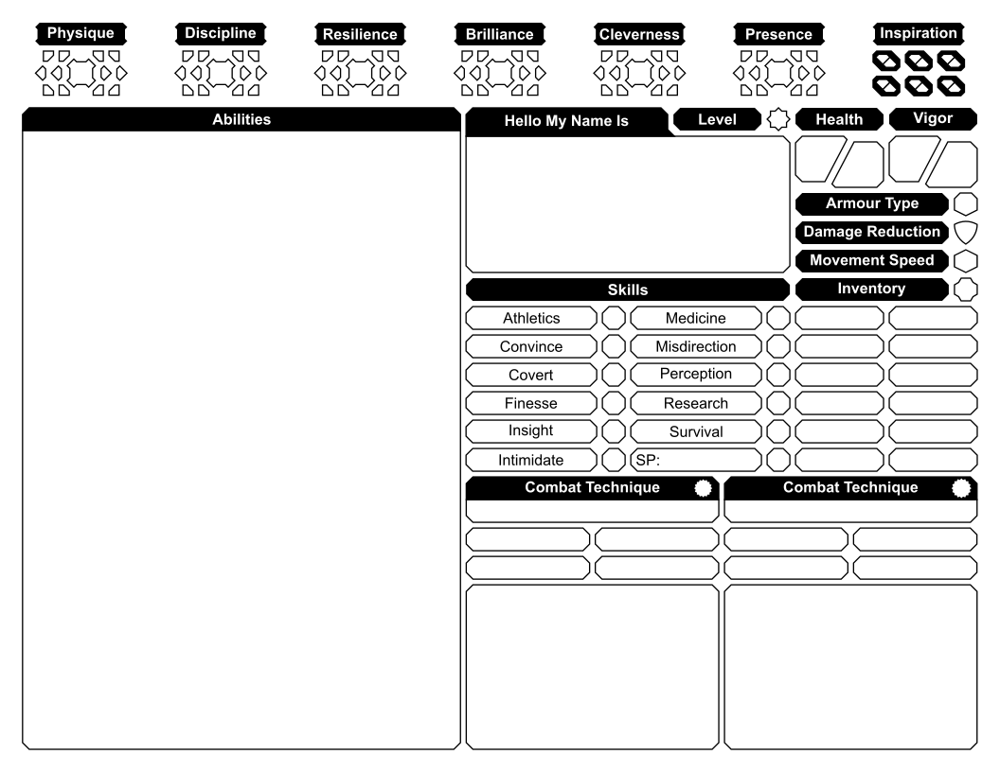
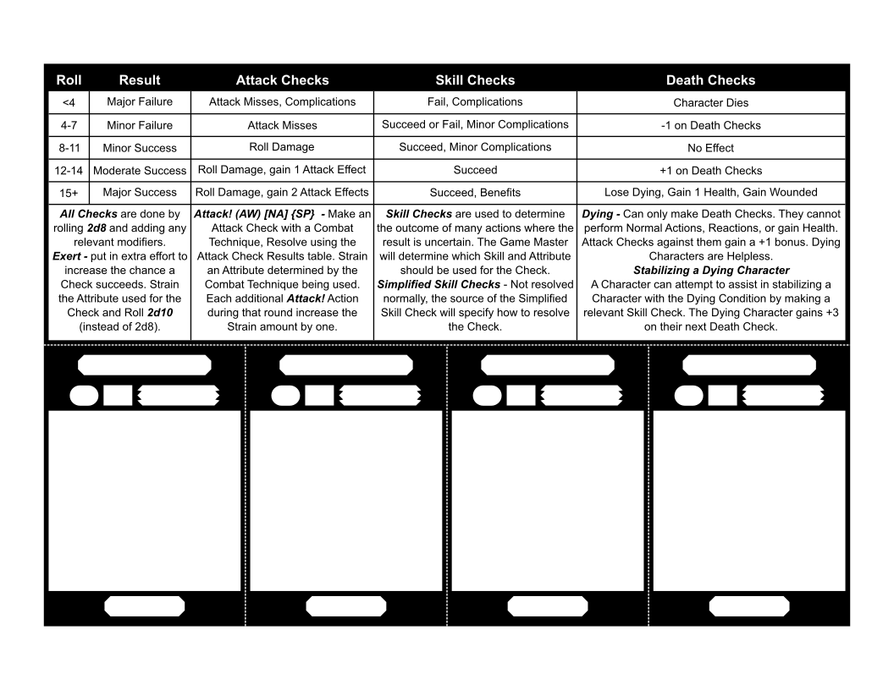

# 🍴🥞 Sturdy Pancake Sheets 🥞🍴

- WIP Character Sheets for [Sturdy Pancake](https://github.com/iclasen/sturdy-pancake)

## [Download The Latest Sheets](https://github.com/zeroskull/sturdy-pancake-sheets/releases/latest)

- Use the option "Actual Size" when printing the PDFs
- Use the PDF viewer in Firefox to add text to the PDFs

## TODO

- [ ] 🎡 Update Example Characters
- [ ] 🥳 Add Group Sheet
- [x] ~~🧙‍♂️ Add Wizard Sheet~~
- [x] ~~🧮 Add General Notes Sheet~~
- [x] ~~🪓 Add More Example Characters~~
- [x] ~~🎴 Add Cards~~

Traditional Sheets

### Character Sheet

---

### Cheat Sheet

---

### Caster & Notes Sheet

---

Card Sheets

- All the elements of a character sectioned into smaller pieces.
- Use scissors, or a blade and straight edge, to cut along the dotted lines.
- The card's dimensions are 63 mm x 88 mm, so they should fit inside of standard card sleeves.
- Print at "Actual Size" or "100% Scaling" for the best accuracy.

### Character Cards

---

### Casting Cards

---

### Cheat Sheet Cards

---

Example Character Sheets

DGJYEOPHF 🗡️☠️🛡️ Assassin

---

Gorman 🛡️🔨🛡️ Tank

---

Mavra 🤛🧙‍♀️📖 Wizard

---

