# 🍴🥞 Sturdy Pancake Sheets 🥞🍴

## [Download The Latest Sheets](https://github.com/zeroskull/sturdy-pancake-sheets/releases/latest)

WIP Character Sheets for [Sturdy Pancake](https://github.com/iclasen/sturdy-pancake)

Table of Contents

- [Getting Started](#getting-started)

- [Traditional Sheets](#traditional-sheets)

- [Card Sheets](#card-sheets)

- [Example Characters](#example-characters)

- [TODO](#todo)

## **Getting Started**

- Download the `sheets.zip` file from the [latest release.](https://github.com/zeroskull/sturdy-pancake-sheets/releases/latest)
- Decide which style of sheet you would like to use for your character.
  - Descriptions and Examples are provided below. Links to relevant sections are located in the Table of Contents above.
- Use the option "Actual Size" when printing the PDFs.
  - If you do not have the "Actual Size" option in your Print Dialog, try using Adobe Acrobat.
- Use the PDF viewer in Firefox to add text to the PDFs.
  - If you want to print the sheet to use in person, remember to not add text to fields that you will have to edit.
- If you would like to edit the layout or content of the sheets, download the `.svg` files in the `svgs` folder from this Git Repo.
  - These sheets were designed in [Inkscape](https://inkscape.org/), but any vector graphics software, like Adobe Illustrator, should work.

## **Traditional Sheets**

- A more standard format for a TTRPG Character.
- Most information contained on one page.
- Separate pages for more complex characters and notes.

### Character Sheet

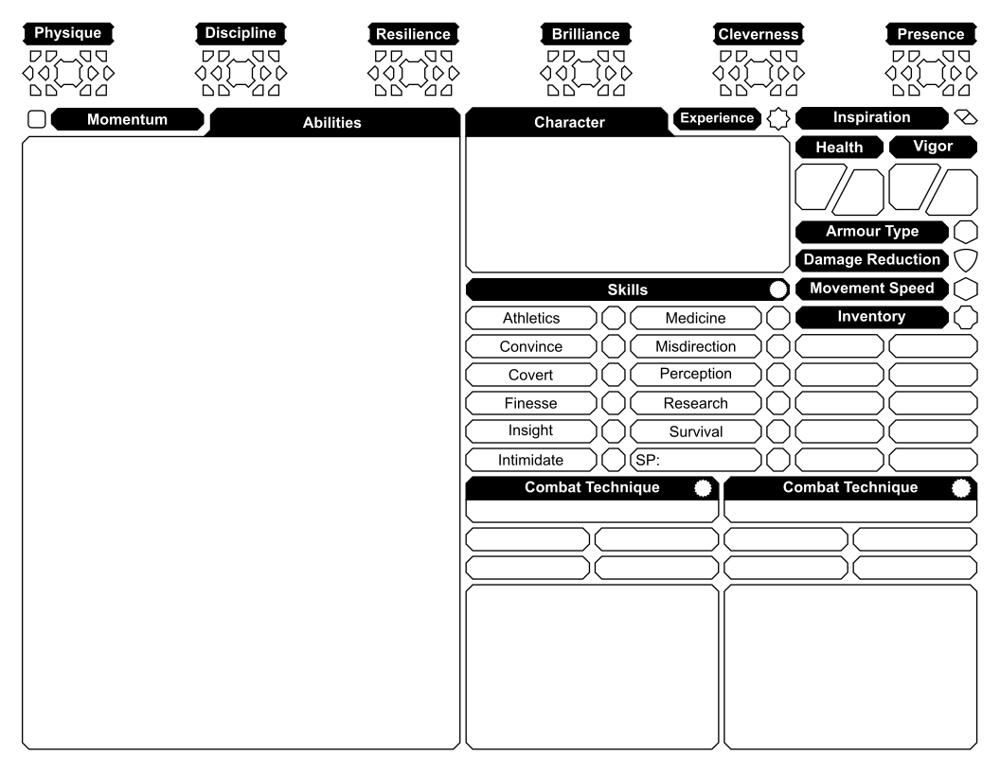

---

### Cheat Sheet

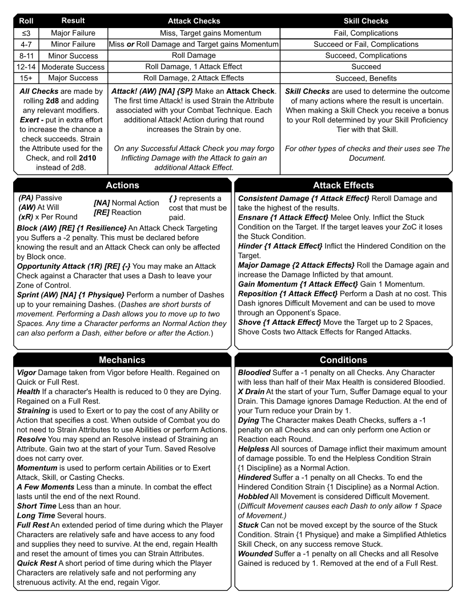

---

### Caster Sheets

**_OUT OF DATE_**

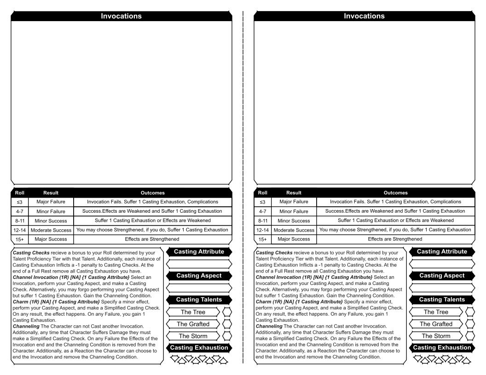

---

## **Card Sheets**

- A more experimental format for a TTRPG Character.
- All the elements of a character sectioned into smaller pieces.
- Ability to customize you Character Sheet layout at the table.
- Using the Card Sheets
  - Print at "Actual Size" or "100% Scaling" for the best accuracy.
  - Use scissors, or a blade and straight edge, to cut along the dotted lines.
  - The card's dimensions are 63 mm x 88 mm, so they should fit inside of standard card sleeves.
  - Fold larger elements in half for more convenient storage.

### Character Cards

**_OUT OF DATE_**

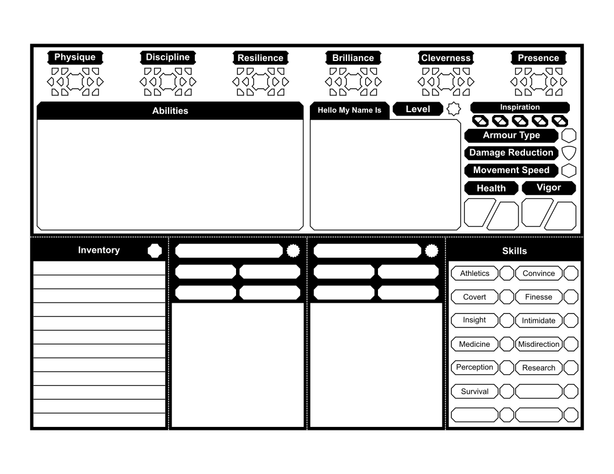

---

### Casting Cards

**_OUT OF DATE_**

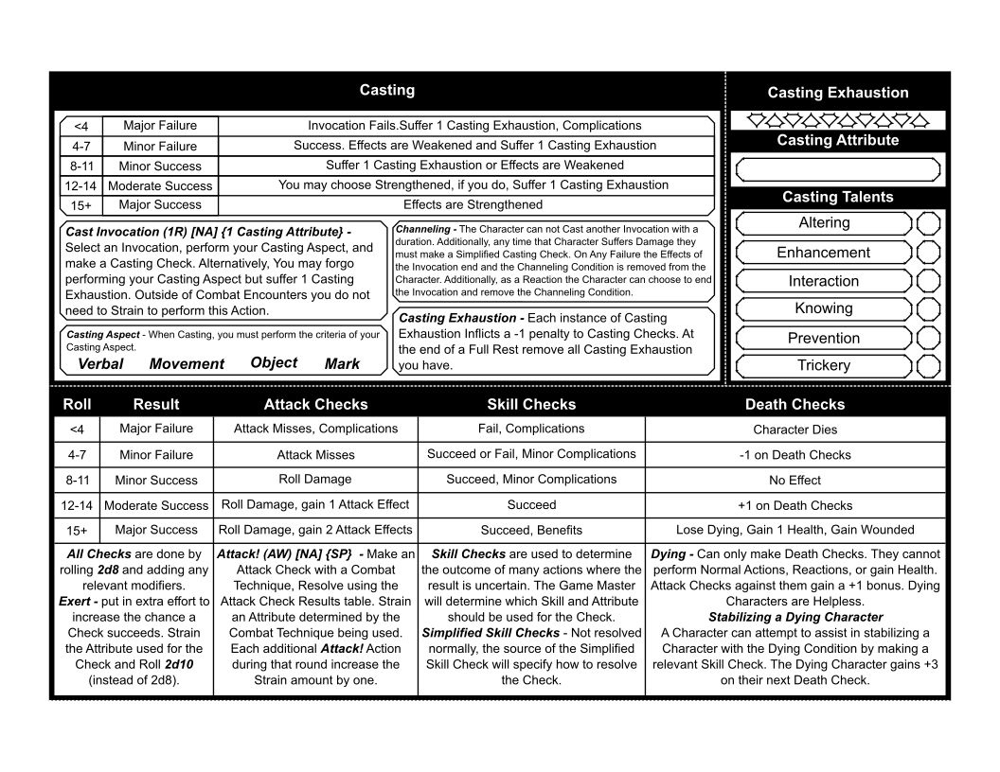

---

### Cheat Sheet Cards

**_OUT OF DATE_**

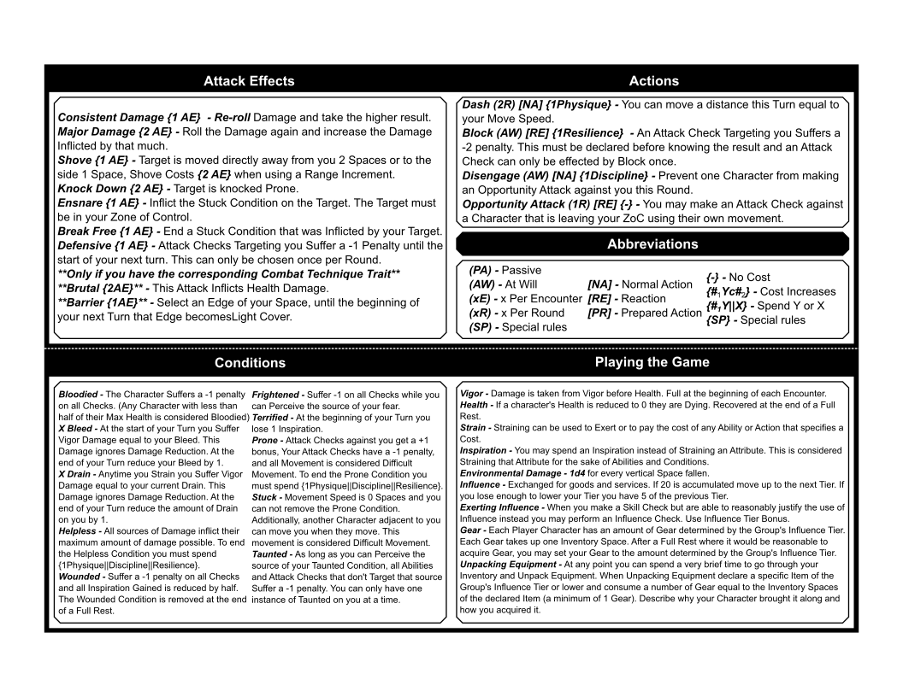

---

### Ability Cards

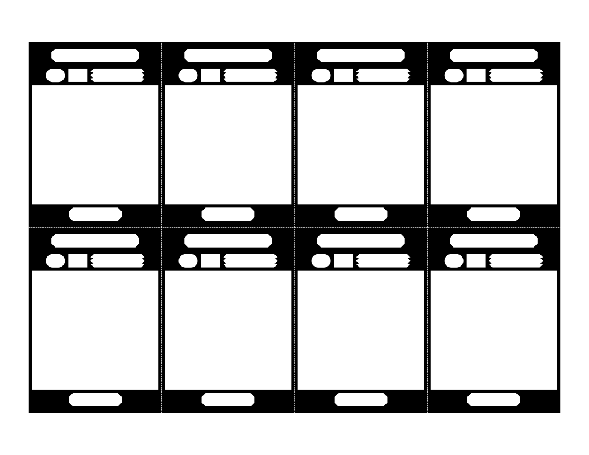

---

### Opponent Cards

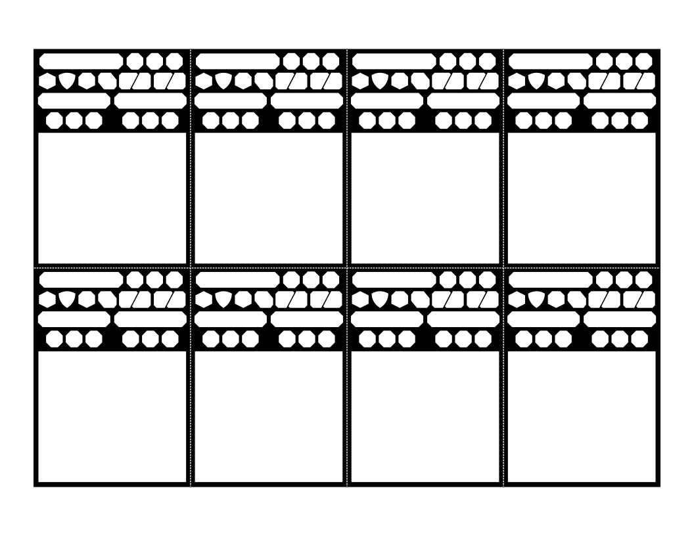

---

## **Example Characters**

### DGJYEOPHF - 🗡️☠️🛡️ - Assassin

**_OUT OF DATE_**

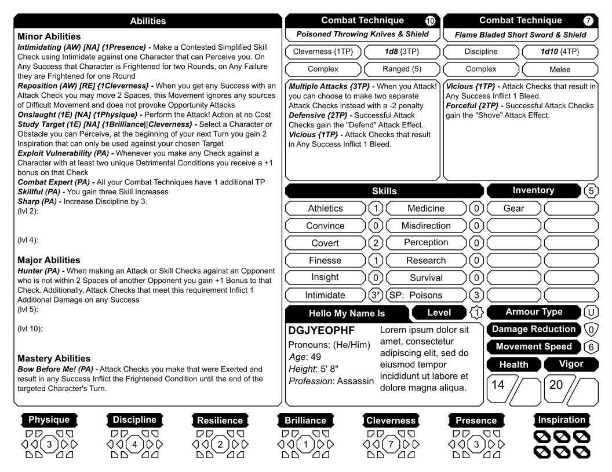

---

### Gorman - 🛡️🔨🛡️ - Tank

**_OUT OF DATE_**

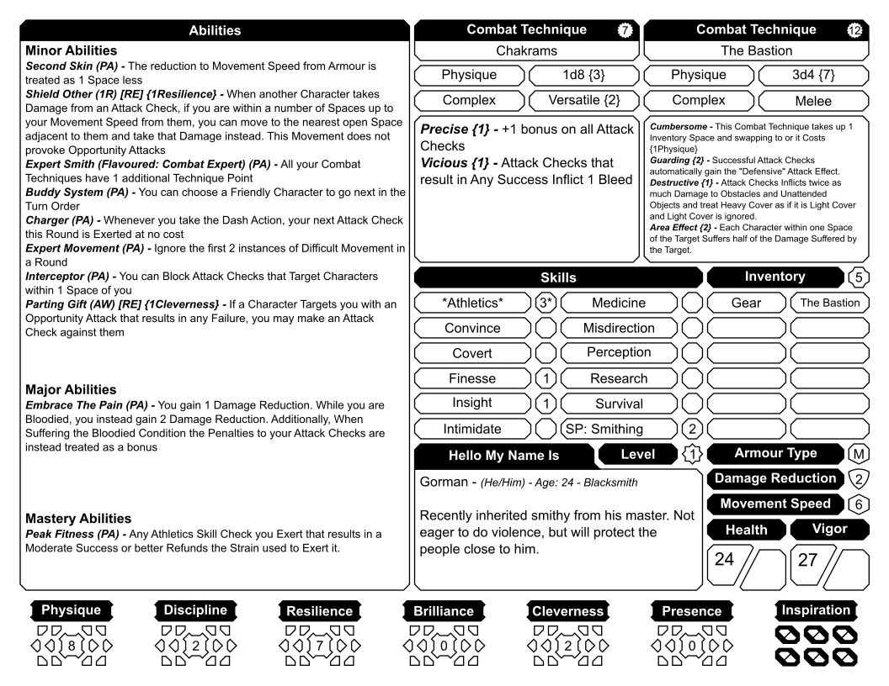

---

### Mavra - 🤛🧙‍♀️📖 - Wizard

**_OUT OF DATE_**

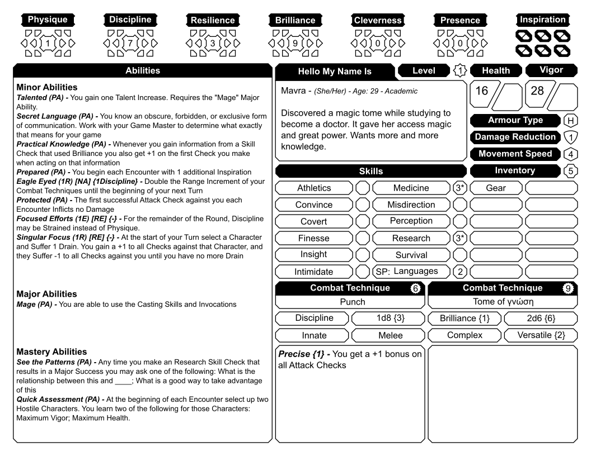

---

## **TODO**

- [ ] 📋 Add Explainer Sheet
- [ ] 🎡 Update Example Characters (2023 09)
  - [ ] DGJYEOPHF
  - [ ] Gorman
  - [ ] Mavra
  - [ ] Torben
- [ ] 🎴 Update Card Sheets (2023 09)
  - [ ] Casting Sheet
  - [ ] Character Sheet
  - [ ] Cheat Sheet
- [ ] 📄 Update Traditional Sheets (2023 09)
  - [ ] Casting Sheet
  - [ ] Character Sheet
  - [ ] Cheat Sheet
- [x] ~~🤵‍♂️ Add Opponent Sheet~~
- [x] ~~🧙‍♂️ Add Wizard Sheet~~
- [x] ~~🧮 Add General Notes Sheet~~
- [x] ~~🪓 Add More Example Characters~~
- [x] ~~🎴 Add Cards~~
