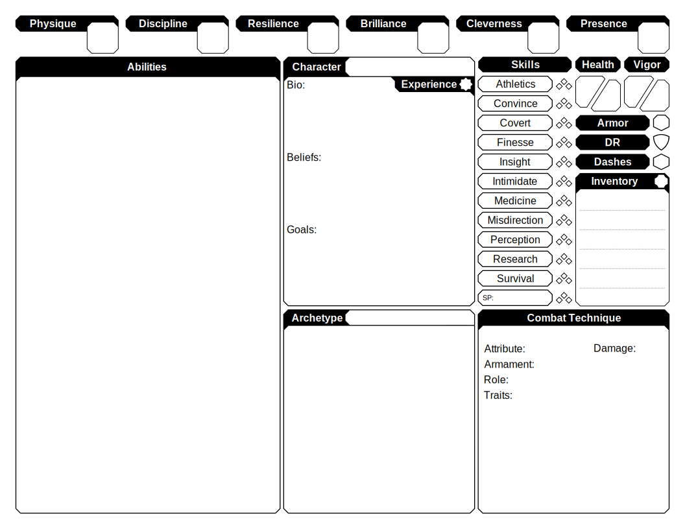
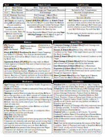
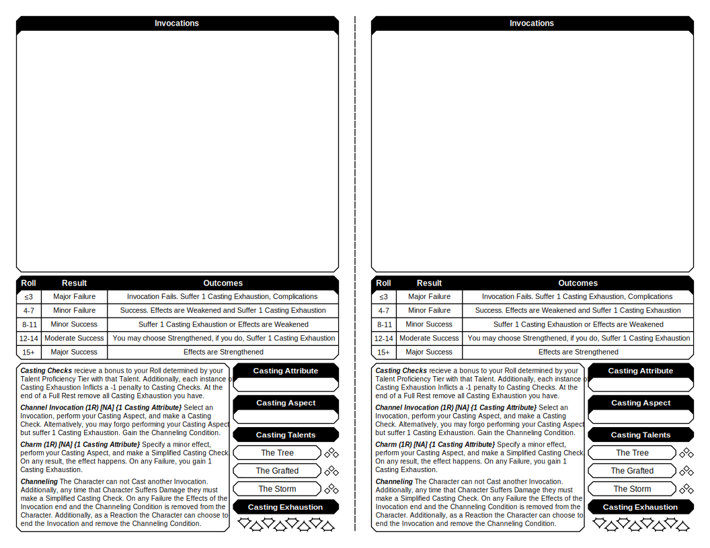
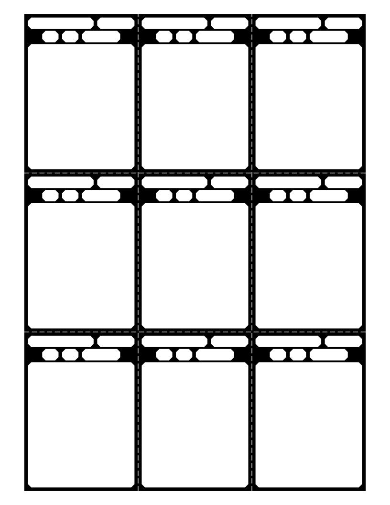

# Sturdy Pancake Sheets

WIP Character Sheets for [Shroudrend](https://github.com/iclasen/sturdy-pancake)

## **Getting Started**

- Download the `.pdf` files from the [latest release](https://github.com/zeroskull/sturdy-pancake-sheets/releases/latest).
- Use the option "Actual Size" or 100% when printing the PDFs.
- Use your web browser's PDF edit features to add text to the PDFs.
  - If you want to print the sheet to use in person, remember to not add text to fields that you will have to edit.
- If you would like to edit the layout or content of the sheets, download the `.svg` files in the `svgs` folder from this Git Repo, or download the Source zip from a release.
  - These sheets were designed in [Inkscape](https://inkscape.org/), but any vector graphics software, like Adobe Illustrator, should work.

### Character Sheet

---

### Character Sheet Overview

---

### Cheat Sheet

---

### Caster Sheets

- Cut along dotted line

---

### Ability Cards

- Cut along dotted lines
- Cards sized to fit in standard card sleeves
- Can be used for Major/Minor Abilities and Invocations

